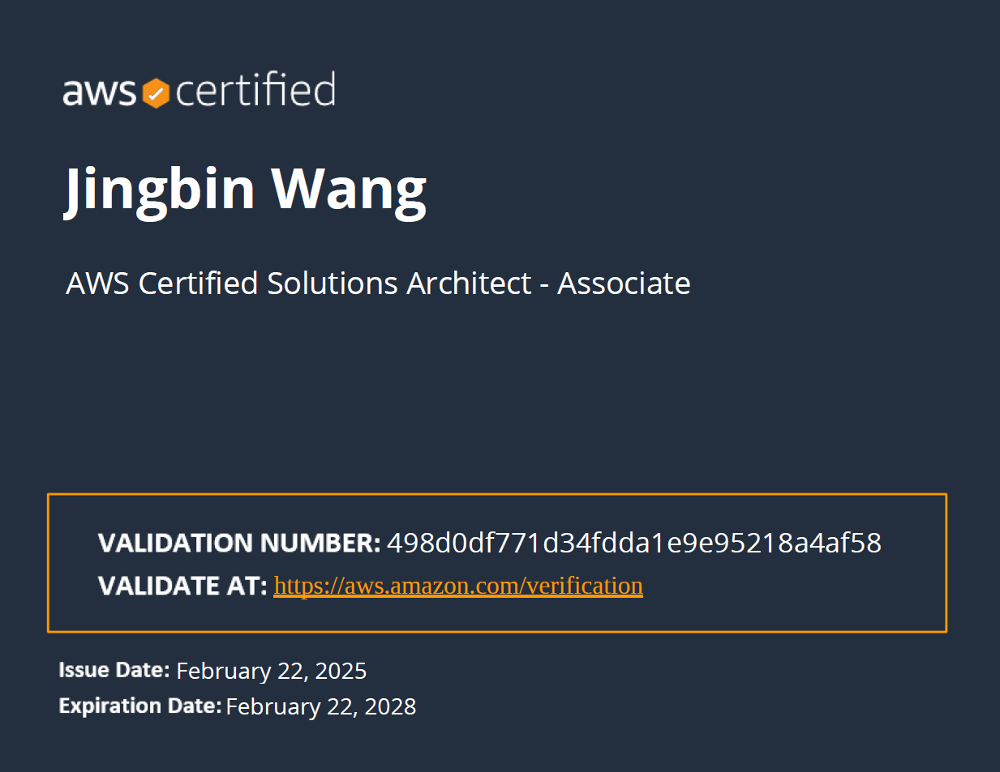

<!-- Hero typing banner -->

  

<!-- Quick badges -->

  
  <!--  -->
  
  <!--  -->
  <!--  -->

<!-- Divider -->
<h3 align="center">
  
</h3>

<!-- GitHub Profile Stats -->

  
### 💻 GitHub Profile Stats

  
 

  

<small><i><b>Note:</b> Most used languages are based only on my public code and don't necessarily reflect depth or professional usage frequency.</i></small>

---
<!-- Contribution Graph -->

  
### 📅 Contribution Graph

---
<!-- AWS Certifications -->

### ☁️ AWS Certifications
#### AWS Certified Machine Learning Engineer – Associate  

#### AWS Certified Solutions Architect – Associate  

<!-- Footer -->

